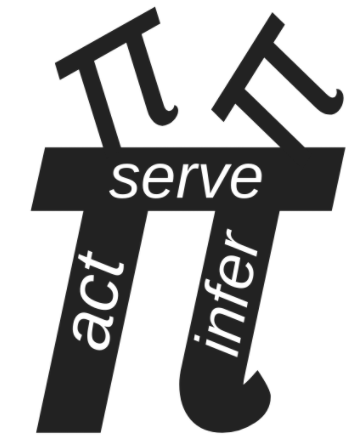
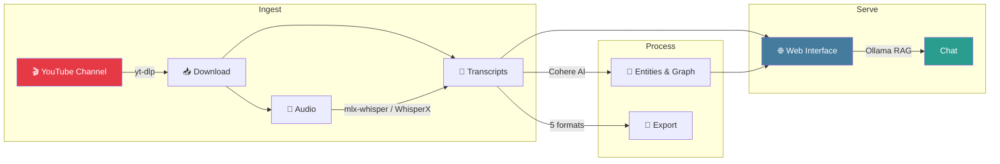
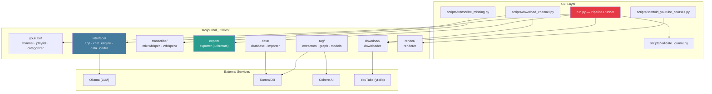

<div align="center">



# Journal-Utilities

**A modular, config-driven pipeline for processing the [Active Inference Institute](https://www.youtube.com/@ActiveInference) video library.**

[](https://www.python.org)
[](#testing)
[](#testing)
[](LICENSE)

*Download · Transcribe · Extract · Export · Browse · Chat*

</div>

---

## How It Works



> **One command** runs the configured application pipeline: `uv run python run.py`
> **One file** controls all options: `config.ini` — [see reference →](docs/configuration.md)

---

## ✨ Features

<table>
<tr>
<td width="50%">

### 📥 Download & Transcribe

Enumerate the Active Inference channel from a saved manifest. Download transcripts, audio, and video with cookie auth, rate limiting, and resume. Transcribe locally on Apple Silicon or GPU.

**→** [Download Guide](docs/youtube_download.md) · [Transcription Engines](docs/transcription.md) · [YouTube Module](docs/youtube.md)

</td>
<td width="50%">

### 🌐 Web Interface & Chat

FastAPI SPA with searchable video library, embedded YouTube player, transcript viewer, and category browser. Ollama-powered RAG chat with automatic context retrieval.

**→** [Web Interface](docs/web_interface.md) · [Chat Engine](docs/chat_engine.md)

</td>
</tr>
<tr>
<td>

### 📄 Multi-Format Export

Batch-export to Markdown, JSON, HTML, PDF, and plaintext — each enriched with metadata headers (title, category, series, speakers, duration, URL, views).

**→** [Export Guide](docs/export.md)

</td>
<td>

### 🧠 Knowledge Extraction

Cohere AI entity extraction (people, concepts, theories, organizations) and relationship mapping into a SurrealDB knowledge graph.

**→** [RAG Pipeline](docs/rag.md) · [Data & Database](docs/data.md)

</td>
</tr>
</table>

---

## 🚀 Quick Start

```bash
# 1. Clone & install
git clone https://github.com/ActiveInferenceInstitute/Journal-Utilities.git
cd Journal-Utilities
uv sync --all-extras

# 2. Run the default pipeline (Config → Validate → Export → Test → Serve)
uv run python run.py
```

### Pipeline Commands

```bash
uv run python run.py config          # Show current configuration
uv run python run.py download        # Download from YouTube
uv run python run.py export          # Export transcripts to all enabled formats
uv run python run.py test            # Run the pytest suite
uv run python run.py serve           # Launch web UI at http://localhost:8000
uv run python run.py full            # Full pipeline: download → export
uv run python run.py journal-check   # Read-only journal integrity gate
```

---

## 🏗️ Architecture



<details>
<summary><strong>Full directory tree</strong></summary>

```
Journal-Utilities/
├── src/journal_utilities/        # Main package
│   ├── youtube/                  #   Channel enumeration, categorizer
│   ├── download/                 #   yt-dlp download engine
│   ├── transcribe/               #   MLX-Whisper + WhisperX
│   ├── data/                     #   SurrealDB client + Coda importer
│   ├── interface/                #   FastAPI SPA + Ollama chat
│   ├── rag/                      #   Entity extraction pipeline
│   ├── render/                   #   Course scaffolding
│   ├── export/                   #   Multi-format transcript export
│   └── utils/                    #   Shared utilities
├── scripts/                      # CLI tools
├── tests/                        # Pytest suite
├── data/                         # Input, output, database storage
├── docs/                         # 10 module guides
├── run.py                        # Pipeline runner
├── config.ini                    # All configuration
└── pyproject.toml                # Python 3.12+
```

</details>

---

## 📚 Documentation

All technical detail lives in `docs/`. The README you're reading is the overview and entry point.
See [`docs/JOURNAL_SCHEMA.md`](docs/JOURNAL_SCHEMA.md) for the ActiveInferenceJournal v2 schema
and [`docs/REFACTOR_READINESS.md`](docs/REFACTOR_READINESS.md) for the refactor pipeline
(`scripts/refactor_journal.py`).

| Guide | What You'll Find |
|-------|------------------|
| [**Configuration**](docs/configuration.md) | `config.ini` sections, environment variables, pipeline step control |
| [**YouTube**](docs/youtube.md) | Channel enumeration, playlist parsing, title categorization |
| [**Download**](docs/youtube_download.md) | Cookie auth, 403 troubleshooting, download strategies |
| [**Transcription**](docs/transcription.md) | MLX-Whisper (Mac), WhisperX (GPU), model selection |
| [**Export**](docs/export.md) | Format details, metadata enrichment, library API |
| [**Web Interface**](docs/web_interface.md) | API endpoints, SPA frontend, development server |
| [**Chat Engine**](docs/chat_engine.md) | Ollama RAG, prompt engineering, model auto-discovery |
| [**RAG & Graph**](docs/rag.md) | Cohere extraction, entity schema, knowledge graph |
| [**Data & Database**](docs/data.md) | SurrealDB schema, Coda import, audit trails |
| [**Render**](docs/render.md) | Playlist → course scaffolding, `module.md` format |
| [**Agent Guide**](AGENTS.md) | Architecture, code patterns, agent development rules |

---

## 🧪 Testing

```bash
uv run pytest tests/ -v --cov=src         # Full suite with coverage
uv run python run.py journal-check         # Journal corpus integrity gate
```

Test counts and coverage are intentionally not embedded in this README because
they change as the suite and corpus evolve. The commands above and CI output are
the live status.

## Journal v2 maintenance

Journal-Utilities is the code-side source of truth for the generated
ActiveInferenceJournal layout. The maintenance sequence is explicit and safe to
repeat:

```bash
uv run python scripts/enrich_metadata.py --journal ../ActiveInferenceJournal
uv run python scripts/enrich_metadata.py --journal ../ActiveInferenceJournal --apply
uv run python scripts/repair_split_transcripts.py --journal ../ActiveInferenceJournal --utilities .
uv run python scripts/generate_journal_indexes.py --journal ../ActiveInferenceJournal
uv run python run.py journal-check
```

Enrichment is dry-run by default; only the command with `--apply` writes metadata.
The final `journal-check` command is read-only and blocks handoff when metadata,
indexes, transcript identities, duplicate handling, coverage, or the `main`
branch's no-audio/no-credentials boundary is inconsistent.

## 🔧 Environment

Required in `.env`:

| Variable | Purpose |
|----------|---------|
| `HUGGINGFACE_TOKEN` | WhisperX speaker diarization |
| `COHERE_API_KEY` | Entity extraction (RAG) |
| `CODA_API_TOKEN` | Coda session data |
| `OLLAMA_MODEL` | Chat model (default: `gemma3:4b`) |
| `OLLAMA_BASE_URL` | Ollama API URL (default: `http://localhost:11434`) |

---

<div align="center">

### 🙏 Acknowledgements

WhisperX pipeline & SurrealDB — Holly Grimm @hollygrimm (2024)
YouTube download & local Whisper — 2025–2026
AssemblyAI scripts — Dave Douglass (2022)

</div>
