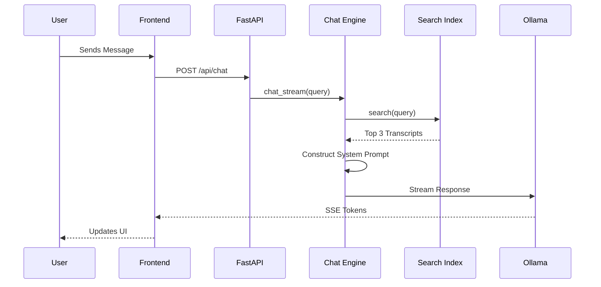

# Chat Engine & RAG

The **Chat Engine** (`src/journal_utilities/interface/chat_engine.py`) powers the interactive Q&A feature in the web interface. It combines local LLM inference (via Ollama) with Retrieval-Augmented Generation (RAG) over the downloaded YouTube transcripts.

## Architecture

1. **Search Index**: High-speed, in-memory BM25 search index (`src/journal_utilities/interface/data_loader.py`) loads all available transcripts.
2. **Context Retrieval**: When a user asks a question, the engine retrieves the top 3 most relevant transcript chunks (approx. 2000 chars each).
3. **Prompt Construction**: System prompts inject the retrieved context and the user's query into the LLM context window.
4. **Inference**: The engine communicates with a local Ollama instance to generate the response.
5. **Streaming**: Responses are streamed to the frontend via Server-Sent Events (SSE) for a real-time experience.

### RAG Data Flow



## Configuration

The Chat Engine is configured via environment variables or `config.ini`:

| Variable | Default | Description |
| :--- | :--- | :--- |
| `OLLAMA_BASE_URL` | `http://localhost:11434` | URL of the local Ollama instance |
| `OLLAMA_MODEL` | `gemma3:4b` | Default model to use (see "Model Selection" below) |
| `CHAT_MAX_CONTEXT` | `8000` | Max characters of transcript context to inject |
| `CHAT_MAX_HISTORY` | `10` | Max number of previous messages to keep in history |

## Smart Model Selection

The engine includes robust logic to select the best available model:

1. **Configured Model**: Tries `OLLAMA_MODEL` first.
2. **Auto-Discovery**: If the configured model is missing, it queries `GET /api/tags` from Ollama.
3. **Heuristic Fallback**: It searches the available models for known chat-capable families (e.g., `gemma`, `llama`, `mistral`, `qwen`, `deepseek`) and selects the best candidate.
4. **Safety Net**: Falls back to the very first available model if no chat-specific model is identified.

**Default Model**: `gemma3:4b` is chosen for its excellent balance of speed and reasoning capability on consumer hardware.

## Running Ollama

You must have Ollama running locally:

```bash
# Install Ollama (macOS/Linux)
curl -fsSL https://ollama.com/install.sh | sh

# Serve the API
ollama serve
```

**Recommended Models:**

```bash
ollama pull gemma3:4b
ollama pull llama3.2
ollama pull mistral
```

## Testing

The Chat Engine is tested with **real methods** wherever possible. Unit tests exercise the prompt construction, context retrieval, and model selection logic without requiring a running Ollama instance, while live browser verification covers the full chat flow.

```bash
# Run unit tests
python -m pytest tests/journal_utilities/test_chat_engine.py

# Live verification
python run.py serve
# Open browser to http://localhost:8000 -> Chat tab
```
