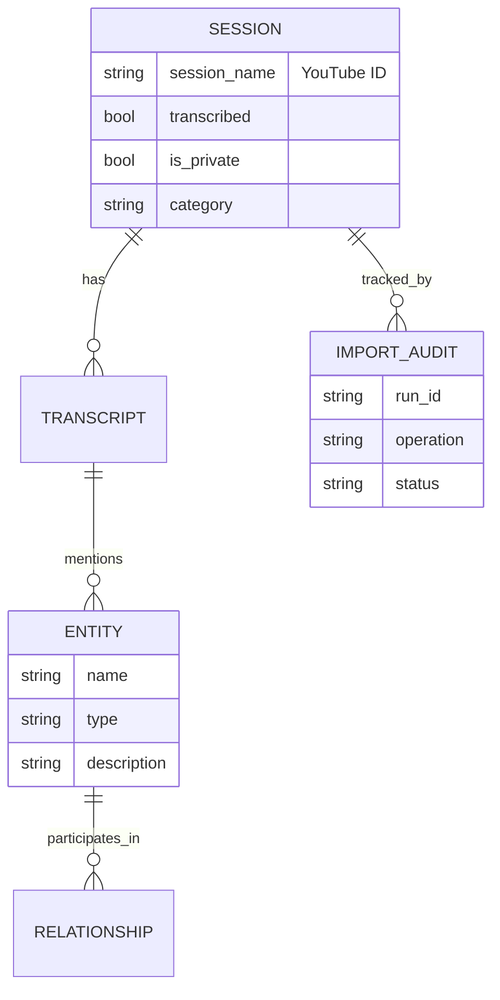

# Data & Database Module

The Data module (`src/journal_utilities/data/`) manages persistence using SurrealDB, ensuring data integrity through a comprehensive audit trail system.

## database Architecture

- **Database**: SurrealDB (WebSocket connection).
- **Client**: Async wrapper (`DatabaseClient`) in `database.py`.
- **Configuration**: Connection details via environment variables or `config.ini`.

### Tables



| Table | Purpose |
| :--- | :--- |
| `session` | Main metadata record for a video/event |
| `import_audit` | Log of all import operations (insert, skip, fail, rollback) |
| `transcript` | RAG transcript records |
| `entity` | Extracted knowledge graph nodes |
| `relationship` | Knowledge graph edges |

## Import Pipeline (`importer.py`)

The system imports metadata from Coda JSON exports.

### 1. Process

1. **Read JSON**: Parses the Coda export file.
2. **Generate Run ID**: Creates a unique `import_run_id` (e.g., `import_2023-10-27T...`).
3. **Iterate Rows**:
    - Extracts YouTube ID.
    - Categorizes event (Series/Episode).
    - Checks for duplicates.
    - Creates `session` record.
4. **Audit Logging**: Every action (insert/skip/fail) is logged to `import_audit`.

### 2. Audit Trail

The `import_audit` table tracks:

- `operation`: `insert`, `skip`, `failed`, `rollback_summary`.
- `status`: `success`, `failed`, `rolled_back`.
- `data_attempted`: The raw data that was processed.
- `error_message`: Stack trace if failed.

## Management Utilities

### Rollback

If an import goes wrong, you can rollback the entire run:

```python
from journal_utilities.data.database import rollback_import

await rollback_import(
    import_run_id="import_2025-02-18T...",
    ...
)
```

This will:

1. Find all sessions created in that run.
2. Delete them.
3. Mark audit log entries as `rolled_back`.

## Configuration

| Env Variable | Default | Description |
| :--- | :--- | :--- |
| `DB_URL` | `ws://localhost:8080/rpc` | SurrealDB endpoint |
| `DB_USER` | `root` | Database username |
| `DB_PASSWORD` | `root` | Database password |
| `DB_NAMESPACE` | `actinf` | SurrealDB namespace |
| `DB_NAME` | `actinf` | SurrealDB database name |
