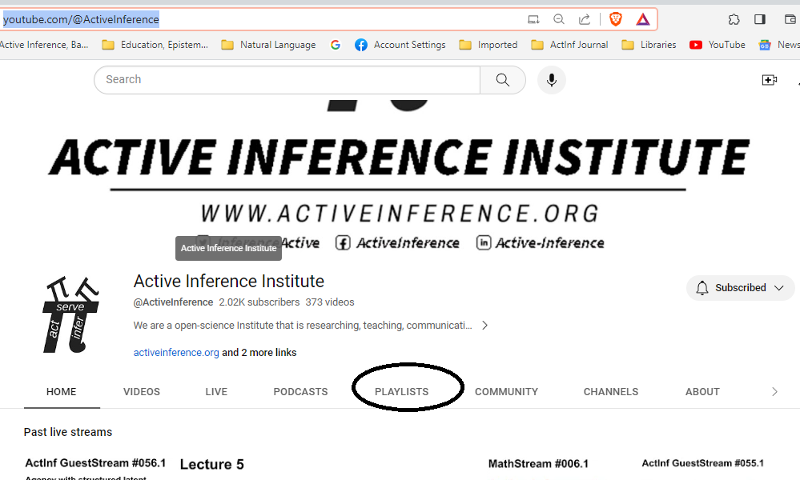
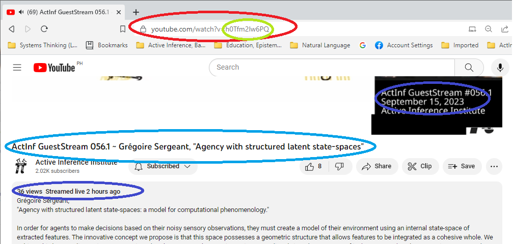
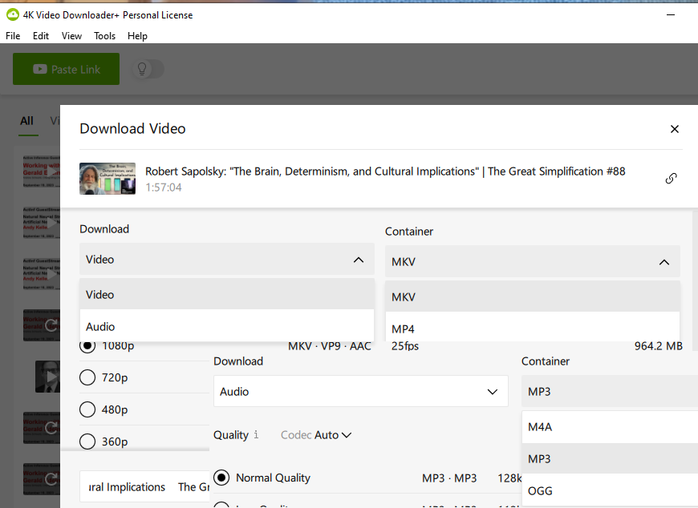

# Editing ActInf Journal Texts

## Metadata

### DocLabel

You need a unique document label, or `DocLabel`, to identify this session and relate various resources related to it. “Related resources” include processing options specific to this session, speaker identities, provenence identification, index references, and so on. 

A `DocLabel` consists of a `volume identifier` and a `text ID` (usually a short string of digits).

### Volume Identifier

At the moment, public-facing AcII artifacts are in a YouTube playlist or in Zenodo (prepublication repository). Items in both are to be assigned to the volume for the playlist.

For session, check <https://coda.io/@active-inference-institute/livestreams> for the volume identifier.

Here are the of volume keys as of September 2023:

| Volume Key | Volume/Playlist                   |
| ---------- | --------------------------------- |
| FrSem21    | 1st Symposium (2021)              |
| 2Symp      | 2nd Symposium (2022)              |
| 3Symp      | 3rd Symposium (2023)              |
| AATxtBk    | ActInf Textbook Group             |
| acBloc     | Active Blockference               |
| bs         | BookStream                        |
| cFPIP      | Physics as Information Processing |
| gs         | GuestStream                       |
| ls         | Livestream                        |
| ma         | Mathstream                        |
| mo         | Modelstream                       |
| OrgOnt     | Organizational Ontology           |
| rt         | Roundtable                        |
| Verses     | VERSES                            |

To identify ALL playlists, go to the Active Inference Institute YouTube home at <https://www.youtube.com/@ActiveInference> and click playlists:



Other Metadata:



### Capture Audio and Video from YouTube

I use 4K Video Downloader https://www.4kdownload.com/ to download both the audio and video of YouTube videos.

When you select the “download video” option, you can also elect to download an auto-transcription and translations into a few European and East Asian languages.

4K Video Downloader Settings:


It usually takes YouTube a few hours to prepare the audio and video to be downloaded. It can take nearly two days to generate auto-translations.

(If you pay a (low, one-time) licensing fee, you get a few extra features, notably being able to download an entire playlist at one shot.)

If you need a transcript more quickly, See Appendix 1 for a quicker way to obtain the audio.

## Audio to Transcript

### Preparing Audio File for Processing by AssemblyAI Cloud

The AssemblyAI Cloud service can use inputs in several different audio formats: 
* WAV gives the best quality results, but uses very large files; 
* M4A gives a good combination of compact files and quality;
* MP3 should probably be used only if you can’t create or transmit WAV or M4A files.

If your audio files are stereo, but the tracks are identical, then mix them down to mono. This may allow you to handle long, high-quality files that AssemblyAI wouldn’t be able to fully process as Stereo.

Convert M4A stereo to mono using FFMPEG:
```
ffmpeg -i input.m4a -ac 1 output.m4a
```

If you want to edit an audio file, Audacity is a high-quality, no-charge tool.

Beware of truncating dead air or noise at the start of an audio extracted from a video\! This will ruin the synchronization of the CC transcript to video, as well as make the resulting transcripts less valuable for editing and indexing.

You CAN, however, mute or attenuate noise or annoying voices; many audio-editing tools make this easy.

AssemblyAI technical documentation gives options for pushing an audio file directly from your local drive to their Cloud service, using the API. 

I have never managed to do this, so I copy it to my Web site and use different API options to push the file from there.

My guess is that if you run the AssemblyAI API call from native Unix (instead of the Linux-under-Windows that I use), you could use the options that push directly from local files to their Cloud.

### Processing Audio in the AssemblyAI Cloud

The AssemblyAI Transcribe Cloud service is invoked via an API call from a Python script that I wrote. See the current version in

****TODO****

## Sentences to Transcripts

Add *.speakers.csv file to the metadata folder with the transcript files.

call [sentencesToTranscripts.py](../2_audio_to_markdown/sentencesToTranscripts.py). Here is a spreadsheet for generating the command line arguments for this script:
https://coda.io/d/ActInf-Journal_dwYsKMwppRN/Tracking-Spreadsheet_supJk#Table-2_tu_Xx/r10

### Finalizing Transcript from Parcellated Fragments

~~This section is not currently being used. It was created as a note related to a long-abandoned way of chopping up and reattaching transcripts for manual editing.~~

<https://coda.io/d/AIJ-Meta-Model_dtIjUlfkIso/Working-Products-v0-1_sucxB#Working-products_tu_Tv/r31&view=modal>

## Finish and Publish Text

### ActInfJournal Editing Philosophy

#### META-PHILOSOPHY of EDITS

I assume that the Active Inference dialogs will form a distinct corpus that will be used over coming decades for a variety of purposes (not all of these currently realizable).

Among the analytical purposes I envision are clarification of which specific lexical *words* are used; documentation of dated usage of technical terms; turn-taking tactics; expansion or narrowing of sense with anaphora and cataphora; and differing expression of “same” concepts in contexts of different interlocutor and assumed audience.

I do not assume that all our clients will have access to, or interest in, the original audio or audivisual embodiments of the dialogs.

The issues of incurrence or avoidance of research debt is directly relevant to philosophy of editing. An editor can spend an extra hour presenting a clear and *consistent* map of the flows and eddies in exposition and dialog, and thereby save readers a thousand cumulative hours of puzzlement or (incalculable) error. In such cases, the editor should feel commensurate joy at gaining so great return on her investment of time and effort.

#### EMPHASIS

Italics are often used in 2020s editorial policy to denote emphasis.

Vocal realization of emphasis can be marked by loudness, higher pitch, or monotone pronunciation.

Dave favors detecting and recording emphasis, preferably with the HTML \<i /\> tag.

Bleu strongly opposes this practice, based partly on difficulty of objectively characterizing emphasis.

#### TIME-FILLERS

Most speakers in live dialog employ time fillers, often for the specific (if tacit) purpose of announcing “I am not done with my speech turn,” and requesting that other speakers not try to begin a new turn (even for a useful purpose of supplying a word that the main speaker is struggling for.

Typical time-fillers:

{I mean}

{like}

{ok}

{so}

{uh}

{um}

{you know}

The use of curly brackets is Dave’s invention (based on checking automatic use of these marks in common text-handling and -display facilities).

Adobe Premiere Plus omits many time-fillers, including some single-word repetitions.

#### SOLECISMS

Solecisms – slips of the tongue, especially *corrected* slips.

Some cases are so simple that the “…” three-dot ellipsis is enough to indicate that the speaker has decided to correct wording, without breaking the flow of ideas. Sometimes the editor can reduce research debt by adding \<i\>emphasis.\</i\>

Solecisms are distinct from space fillers. 

An example is a speech by Daniel in Session 0 of Fields et al. “Quantum.”  
03:56 Let’s get let’s jump in.

I changed this to 

03:56 Let’s {get let’s} jump in.

I assume there was competition among “Let’s get going” and “Let’s jump in,” with elements of both phrases being expressed.  
I preserve the original words (for sake of the Offical Transcript and perhaps of the SubRip, SRT), but indicate that the marked words should be deleted for the sake of hard-copy publication.

#### META-DIALOG MARKS

“Embedded speaker” 

In some dialogs (notably Solms GuestStream 016), a speaker presents an extended discussion of a viewpoint with which he disagrees, or which he scrutinizes skeptically. When possible, Dave sets these embedded attributed speeches in double quotes. For print, this use of inline quotation might be offset (i.e. with double indention and no quotes).

The same relation between speaker and attributes speech appears when the main speaker disagrees with the employment of specific vocabulary (rather than with a series of propositions). Italics, double quotes, or a different font might be in place for these brief attributions.

Specific speakers use certain vocal gestures characteristically as fime-fillers, while others use the same sequences as part of the main text, as comments on what one is saying, as interpersonal markers, or as all of these within a single dialog.  
Notable in this group are “you know” and “I mean.”  
It is only by acquaintance with a given speaker’s vocal habits, that one can reliably distinguish these various usages – and thus accurately re-represent their use in any single speech turn.

ARTIFACTS of some input techniques

By design, Adobe Premiere Pro deletes filler words that it detects, notably “um” and “uh.”

Adobe sometimes deletes words for no obvious reason.

Adobe is less accurate in identify individual, isolated words than Google/YouTube Transcribe.

Adobe seems to insert a “function” word, such as a one-syllable preposition or pronoun, solely because its syntactic model predicts that word in that position. If you don’t hear any word there, and you don’t see one in the youTube transcript, feel free simply to delete it (while paying attention to the possibility of other adjustments needed in the vicinity).

Some speakers, because of a combination of slow speech and wide ranges of pitch and cadence, are misidentified in Adobe as two different speakers. Chris Fields and Adam Safron show this anomaly. If you use Adobe’s option of transcribing without speaker identification, this problem disappears. (It is worth the time to extract two distinct transcription, and to then splice these transcripts “back together” based on time stamps at the word level (in the files with extensions “.caption07.csv”) because Adobe’s parse and word identification is corrupted by spurious end-of-speech events.)

#### OTHER CHOICES

When an word or phrase is duplicated, and I leave one intact while marking the other(s) for {deletion,} my rule is (a) at start of sentence leave the first intact; (b) at end of sentence leave the last intact; (c) otherwise leave the LAST intact. This heurism reconciles the criteria of minimizing retyping with that of leaving typographically intact the part of the speech that most *flows* according to the speaker’s intention, which is (almost by definition) the temporally-last part.

#### CITATIONS

Strunk & Hong

Principle 6. Do not break sentences in two.

Principle 9: Make the paragraph the unit of composition: one paragraph to each topic.

“In dialogue, each speech, even if only a single word, is a paragraph by itself; that is, a new paragraph begins with each change of speaker. The application of this rule, when dialogue and narrative are combined, is best learned from examples in well-printed works of fiction.” P. 26

References

William Strunk & Chris Hong (2011) The Elements of Style.

## APPENDICES

### Appendix 1. Accelerated extraction of online audio.

After you post a video to YouTube, Google/YouTube adds value to it, notably autogenerated CC text and scrolling transcript (in the original language), autogenerated rough translations, and chapter headings. These can take from six or so hours to a couple of days to complete; in a few cases YouTube never generates the artifact, so you have to use a different method to create it.

You can shortcut this process in a few ways.

For audio, you can run a local audio-capture (or, perhaps, video-capture) process on your PC, and play the video in real time through the YouTube player (stand-alone or in a browser, as determined by your operating system and configuration).  

Alternate methods to extract audio:

#### A1.1. Record audio directly from the Web.

Install Audacity (audacity.com) and required resources (Ffmpeg, Virtual Cable…).

Queue the YouTube session to timestamp 0:00:00 and halt it there, with play volume at (or near) maximum;

Create an Audacity session configured to capture audio in a compatible, high-quality format;

Set Audacity to Record;

Play the YouTube video to the end;

Save the Audacity session (in case you need to edit or create alternate versions of the audio);

Export to an appropriate format (WAV is lossless but big; M4A is compressed and good quality; MP3 is slightly smaller than M4A and compatible with a few software packages that don’t accept M4A, but is of lower quality).

#### A1.2. Extract audio using VLC Media Player.

VLC Media Player has a feature under Media \> Convert that extracts the audio track of a downloaded video. It’s not very user-friendly, so you should watch a training video and practice.

### Appendix 2. Extracting YouTube subtitles.

You can scrape auto-generated subtitles direct from YouTube, or use various utilities to extract subtitles and Google/YouTube automatic translations.

#### A2.1. Display Transcript by clicking the button in Comments.

#### A2.2. Extract Video using 4K Video Downloader (free or cheap editions), selecting the target languages you’d like to receive Google/YouTube auto-translations for. 

This utiltity is able to deliver only a small subset of the translations that YouTube makes available.

#### A2.3. There are other free packages that extract additional target languages, in additional to a variety of other content metadata.
