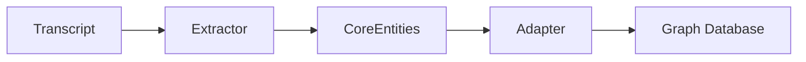

# RAG & Entity Extraction Module

The RAG module (`src/journal_utilities/rag/`) extracts structured knowledge from transcripts to power downstream applications like the Chat Engine and Knowledge Graph.

## Architecture

The data flows through a linear pipeline:



## Components

### 1. Extractor (`extractors/`)

Uses LLMs to extract entities from raw text.

- **`CohereExtractor`**: Uses Cohere's Command models to Identify entities (People, Concepts, etc.) and their relationships.
- **Input**: Raw text chunk (approx 2000-4000 tokens).
- **Output**: JSON object matching `CoreEntities` schema.

### 2. Schema (`schemas/`)

Defines the ontology for extraction.

- **Entities**: `Person`, `Organization`, `Concept`, `Publication`, `Event`, `Location`, `Theory`, `Methodology`.
- **Relationships**: `authored`, `proposed`, `criticized`, `collaborated_with`, etc.

### 3. Graph Client (`graph/`)

Manages interaction with SurrealDB.

- **Nodes**: Stores entities as graph nodes (e.g., `person:karl_friston`).
- **Edges**: Stores relationships as graph edges (e.g., `authored` -> `concept:free_energy_principle`).
- **Idempotency**: Ensures entities are merged rather than duplicated.

## Pipeline (`main.py`)

The `JournalRAGPipeline` class orchestrates the process:

1. **`process_transcript(transcript)`**:
    - Creates a `Transcript` record in DB.
    -Calls `extractor.extract_core_entities()`.
    - Converts results via `EntityAdapter`.
    - Upserts entities and relationships to SurrealDB.

## Usage

```bash
# Run the extraction pipeline on all new transcripts
make extract-entities
```

## Configuration

| Variable | Description |
| :--- | :--- |
| `COHERE_API_KEY` | API Key for Cohere AI |
| `COHERE_MODEL` | Model ID (e.g., `command-r-plus`) |
| `DB_URL` | SurrealDB connection string |
