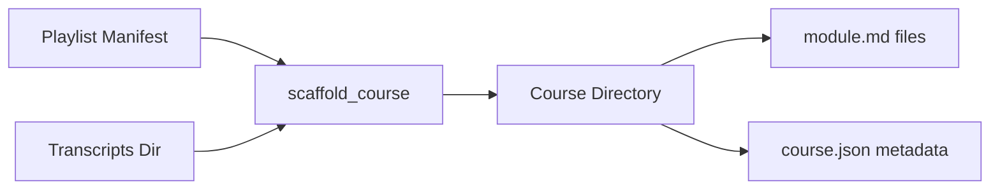

# Render Module

The Render module (`src/journal_utilities/render/`) transforms YouTube playlists into structured course directories with transcript-based `module.md` files.

## Architecture



## Components

### `renderer.py`

| Function | Description |
| :--- | :--- |
| `slugify(title, max_length=60)` | Convert titles to filesystem-safe slugs (lowercase, hyphens, truncation on word boundaries) |
| `format_duration(seconds)` | Format seconds to `H:MM:SS` or `M:SS` strings |
| `format_upload_date(upload_date)` | Convert `YYYYMMDD` to `YYYY-MM-DD` |
| `render_module_md(...)` | Generate `module.md` content with YAML metadata, YouTube link, and transcript text |
| `scaffold_course(...)` | Create numbered module directories with `module.md` files from a playlist |

### Course Directory Structure

```text
data/courses/{course-slug}/
├── course.json          # Playlist metadata (title, slug, video_count, last_updated)
├── 01_video-title/
│   └── module.md        # Transcript with YouTube link and metadata
├── 02_another-video/
│   └── module.md
└── ...
```

### `module.md` Format

Each generated module contains:

- **Title** (H1 heading)
- **Source link** to the original YouTube video
- **Playlist** name (if available)
- **Duration** and **upload date**
- **Transcript method** (e.g., `auto_caption`)
- Full transcript text

## Usage

### Via Script

```bash
# Scaffold courses from playlists
python scripts/scaffold_youtube_courses.py

# Enumerate playlists only (no downloads)
python scripts/scaffold_youtube_courses.py --enumerate-only

# Full pipeline: enumerate, download transcripts, scaffold
python scripts/scaffold_youtube_courses.py --download --max-playlists 3
```

### Library

```python
from journal_utilities.render.renderer import scaffold_course, slugify

result = scaffold_course(
    course_slug="active-inference-livestream",
    videos=[{"id": "abc123", "title": "Livestream #1", "duration": 3600}],
    transcript_dir=Path("data/output"),
    courses_dir=Path("data/courses"),
    playlist_title="Active Inference Livestream",
)
print(f"Created {result['created']} modules")
```

## Configuration

The render module does not require configuration beyond the input directories. It is typically invoked via `scripts/scaffold_youtube_courses.py`, which accepts CLI arguments for transcript and course directories.
