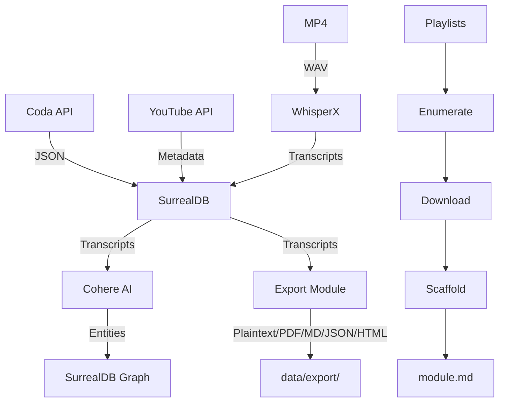

# Source Code (`src/`)

This directory contains the two main Python packages that power Journal-Utilities.

### Packages

#### `journal_utilities/`

**Unified Transcription, RAG, and Course Scaffolding Pipeline**

Local transcription of YouTube videos using WhisperX, entity extraction via Cohere (RAG), playlist enumeration, and course scaffolding.

- `data/` - Database and file organization
- `download/` - YouTube transcript, audio, and video downloading
- `transcribe/` - WhisperX (GPU) and MLX (Apple Silicon) transcription
- `rag/` - Entity extraction and graph construction
- `export/` - Multi-format transcript export (plaintext, PDF, Markdown, JSON, HTML)
- `interface/` - Transcription search and browsing
- `llm/` - LLM tool integration
- `youtube/` - YouTube API and playlist management
- `render/` - Course scaffolding and markdown generation
- `utils/` - Shared utilities

## Data Flow



## Usage

```bash
# Transcription pipeline
make transcribe

# Entity extraction
make extract-entities
```
