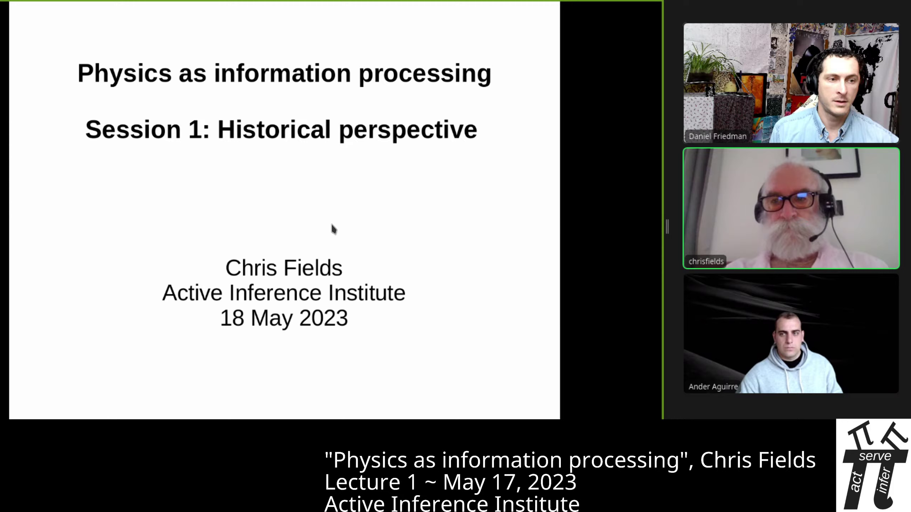

---
title:  'Physics as Information Processing - Lecture 1, "Historical Perspective"'
author:
- 'Chris Fields (Allen Discovery Center at Tufts University) [{ width=12px }](https://orcid.org/0000-0002-4812-0744)'
- 'Daniel Friedman (Active Inference Institute; University of California, Davis) [{ width=12px }](https://orcid.org/0000-0001-6232-9096)'
contributor: 'David S. Douglass (Active Inference Institute) [{ width=12px }](https://orcid.org/0000-0001-7894-8019)'
date: "2023-05-18 Version 0.1.0"
doi: 10.5281/zenodo.9999999
...
{ width=100% }

## INTRODUCTION
00:05 _Daniel:_
 Hello and welcome, everyone, to the Active Inference Institute.
 This is Session 1 of the course "Physics as Information Processing" with Chris Fields.

00:20  And then we'll carry on with the first lecture,
 here.
 Check out the video description for a link to the [Course Overview website](https://coda.io/@active-inference-institute/fields-physics-2023), where you can ask questions that will be answered asynchronously; register to participate in the discussions, which happen about two weeks after each of the six lecture sessions; and just learn more about this area.

01:19 _Chris:_
 Thank you, Ander.

## HISTORICAL PERSPECTIVE: PHYSICS
01:49  This is a course on "Physics as Information Processing," and this first session will be a historical perspective on the idea that physics is, or is about, information processing.

{ width=100% }

 And I'll just start with a few quotations that span the middle of the 20th century - from **[Ludwig] Wittgenstein** in the 1920s saying "The world is all that is the case,"
 so, defining the world in terms of facts, not objects;

## Appendix: Terminology

Active Inference

:   Active Inference is a Process Theory related to Free Energy Principle .

Inference

:   Process of reaching a (local or global) conclusion within a Model, for example with Bayesian Inference.

Information

:   Measured in bits, the reduction of Uncertainty on a Belief distribution of some type. Usually Syntactic (Shannon) but also can be Semantic (e.g. Bayesian ).

{ width=5% } Act to connect with The Institute by [web](https://activeinference.org), [email](mailto:Blanket@ActiveInference.Institute), [YouTube](https://www.youtube.com/c/ActiveInference/videos), [Discord](https://discord.gg/8VNKNp4jtx), or [LinkedIn](https://www.linkedin.com/company/active-inference/).
